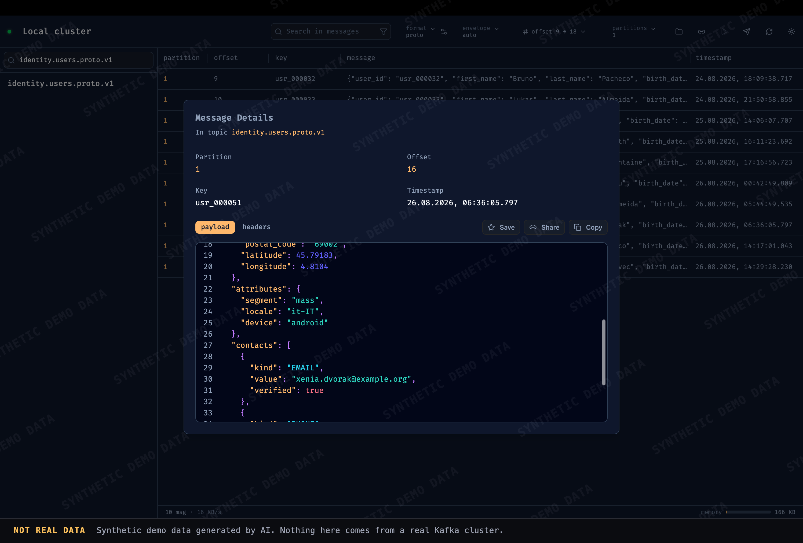
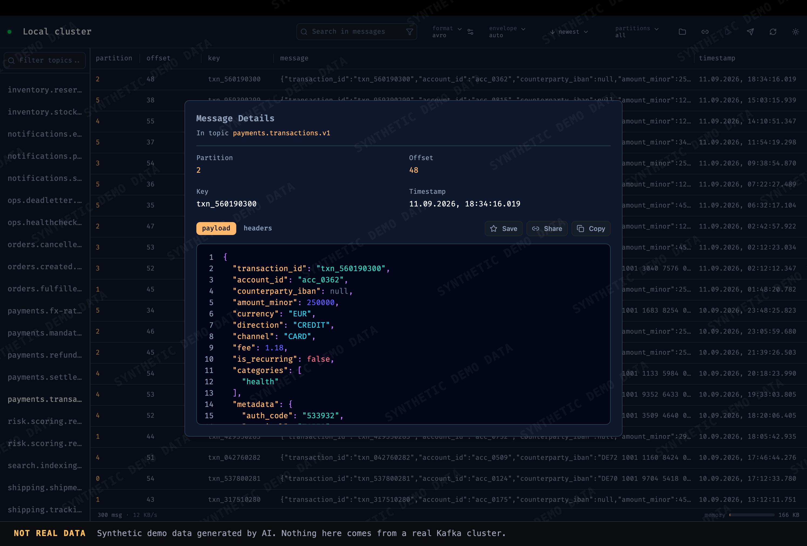
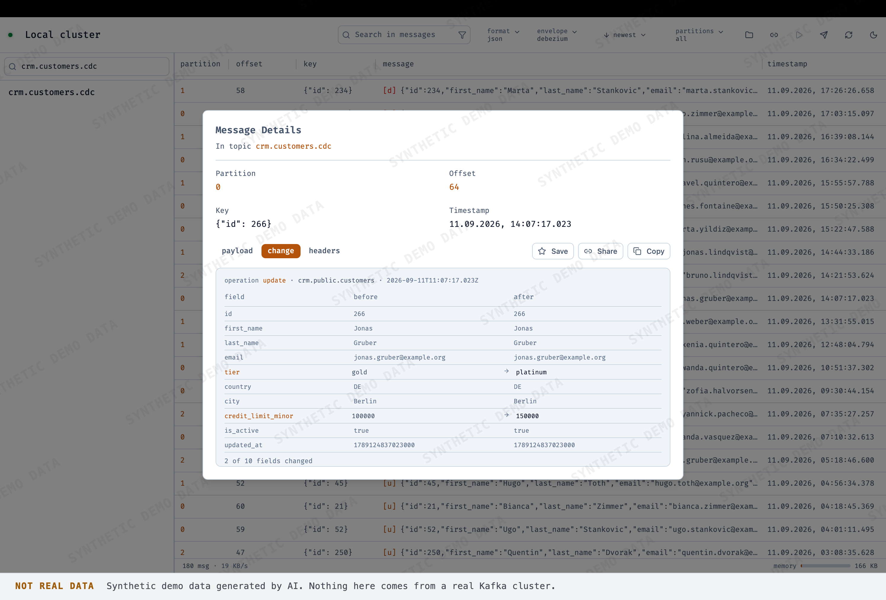
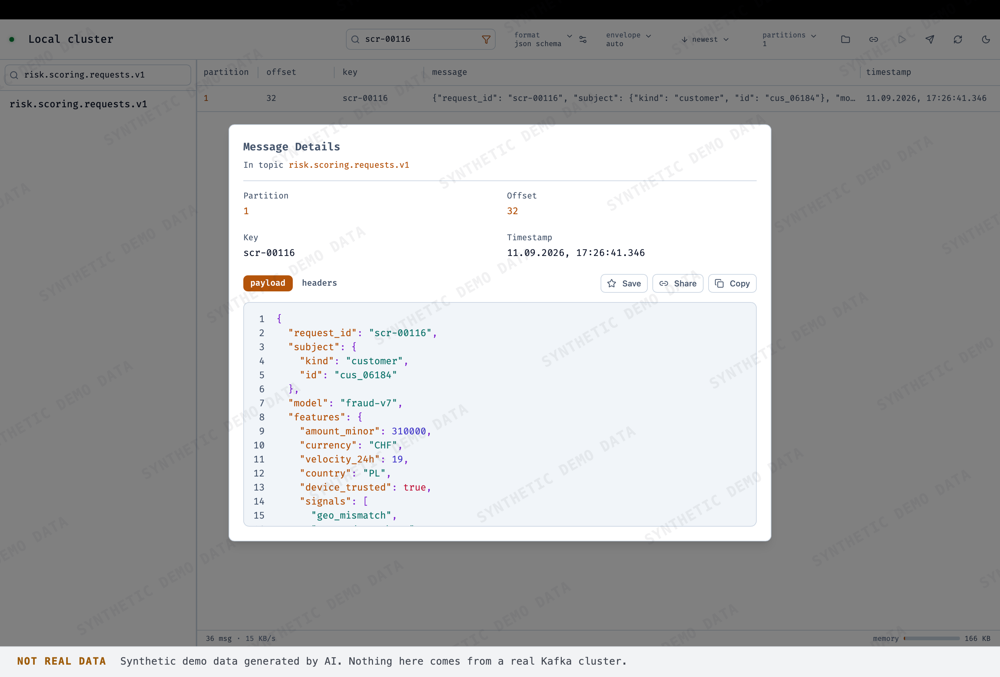
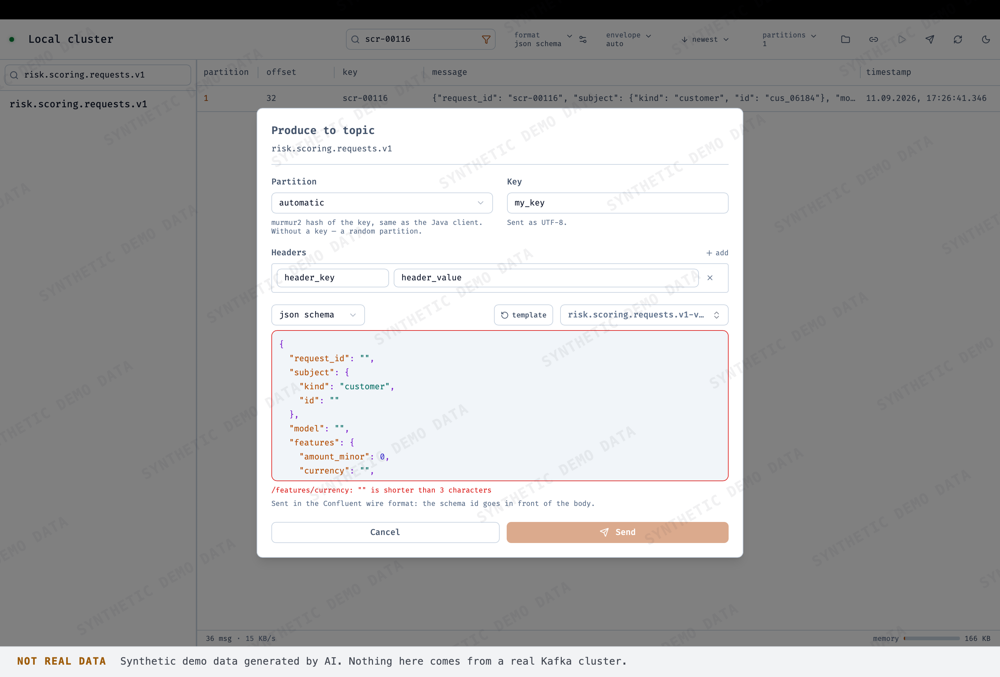

# mikui

A desktop Kafka messages viewer. Browse clusters, read and search topics with
schema-aware decoding, produce validated messages — locally, without touching
the data plane of anyone else.

Built with [Tauri 2](https://v2.tauri.app): a Rust backend that talks to Kafka
and owns the data, and a React frontend that only ever sees the visible
viewport.



*Protobuf bodies decoded against the topic's `.proto`, with one message opened
on its payload tab.*

Every screenshot on this page was taken against the throwaway local cluster in
[`demo/`](demo/README.md): the topics, the names and the payments in them are
generated, and none of it comes from a real cluster.

|     |     |
| --- | --- |
| [](demo/screenshots/watermarked/avro_preview.png)<br>**Avro from the registry.** Six partitions merged into one log by timestamp, and the schema fetched by the id in the message itself. | [](demo/screenshots/watermarked/json_debezium_preview.png)<br>**The Debezium lens.** The `change` tab diffs `before` against `after`, names the operation and counts the fields that moved. |
| [](demo/screenshots/watermarked/jsonschema_preview.png)<br>**JSON Schema, and a search that runs in Rust.** One message left of the whole topic after filtering — which happens on the Kafka worker thread, before anything crosses into the UI. | [](demo/screenshots/watermarked/produce_jsonschema_preview.png)<br>**Producing against a contract.** The editor says in human terms why the body does not fit the schema — before the message is written, not after. |

## Features

### Clusters

- **Multiple saved clusters** with named connections; everything is stored
  locally in the app config directory.
- **Full security matrix**: `PLAINTEXT`, `SSL`, `SASL_PLAINTEXT`, `SASL_SSL`;
  SASL `PLAIN`, `SCRAM-SHA-256`, `SCRAM-SHA-512`; mutual TLS with a client
  certificate; a custom CA bundle; optional hostname-check and
  certificate-verification switches. Passwords live in the OS keychain, not in
  config files.
- **Confluent Schema Registry** per cluster — URL, basic auth, and its own CA
  bundle (the registry often sits behind a different front than the brokers).
- **Several users per cluster, switchable on the fly**: keep a personal account
  and a service one, and change the active user without re-entering
  credentials.

### Topics

- Topic list with instant, case-insensitive filtering by name; sorted with a
  locale-aware collator, and shortest matches first while searching.

### Reading messages

- **Choose the partitions** to read from, or take them all.
- **Choose the starting point**: newest messages (tail), oldest, or an exact
  `from`–`to` range by offset or by timestamp.
- **Smart ordering**: partitions are merged by timestamp with the offset as a
  tiebreaker, so the view reads like one log regardless of where the messages
  physically are.
- **Format-aware decoding**: `text`, `json`, `json schema`, `proto`, `avro`,
  and `hex` (raw bytes, to copy and carry away).
- **Schema Registry integration**: the subject for a topic is detected
  automatically, the format switches to match, and the schema can also come
  from local `.avsc`/`.proto`/`.json` files.
- **Debezium / Kafka Connect envelopes** are recognized and shown as a lens:
  `before`/`after` diff with human operation names (`create`, `update`, …),
  next to the untouched full envelope.
- **Filters and search over the decoded body** — by key or by body, with or
  without case sensitivity; filtering happens in Rust, before anything crosses
  the UI boundary.
- **Deep search over the whole topic**: runs in the background without
  blocking the view, and can be stopped at any moment.
- **Syntax highlighting and pretty-printing** for decoded bodies; large
  messages are formatted on demand.
- **Keyboard navigation**: `↑`/`↓` walk the message list, `←`/`→` cycle the
  detail tabs (`payload`, `envelope`, `headers`) — no mouse needed.

### Topic info

- Partition count, message counts and their distribution across partitions,
  with per-message size estimates.
- When `DescribeConfigs` is available, the full topic configuration is shown.

### Producing

- Send in any of the reading formats — `json`, `avro`, `proto`, `hex`, and the
  rest.
- **Validation against the topic schema** before sending: the editor explains
  in human terms why the entered value does not fit the contract, rather than
  quietly writing a message no consumer can read.
- **Placeholders worth sending**: a one-click skeleton from the JSON Schema,
  an example Avro record, or a Protobuf template pre-filled with plausible
  values (random UUIDs, realistic timestamps).
- Syntax highlighting and formatting in the producer editor too.

### Favorites and sharing

- **Save any message to disk** — favorites persist across restarts, together
  with the full body.
- **Share a link to a specific message** (`mikui://message/v1?…`): it opens the
  exact message on a colleague's machine, matching the cluster by its Kafka
  `cluster.id` and asking for confirmation before connecting.

## Development

### Prerequisites

- **Node.js 22+** and npm
- **Rust** (stable toolchain, via [rustup](https://rustup.rs))
- Platform extras:
  - **macOS** — Xcode Command Line Tools
  - **Linux** — `libwebkit2gtk-4.1-dev librsvg2-dev patchelf` plus the usual
    build tools (`gcc`, `make`, `perl` — the latter two also cover the vendored
    OpenSSL build)
  - **Windows** — Visual Studio with the *Desktop development with C++*
    workload, and CMake with Ninja. The `cmake` crate that builds librdkafka
    requires an explicit generator: run builds from a VS environment, or set
    `CMAKE_GENERATOR=Ninja` (see the notes in `src-tauri/Cargo.toml` and
    `.github/workflows/ci.yml` for the why)

### Run and build

```sh
npm install          # once
npm run tauri dev    # dev mode with hot reload
npm run tauri build  # production build, bundled per platform
```

Useful extras:

```sh
npm run build                                  # frontend only (tsc + vite)
cargo test --manifest-path src-tauri/Cargo.toml  # backend unit tests
npm run icons                                  # regenerate app icons (python3)
```

### Demo cluster

A one-command local cluster — a broker, a Schema Registry and topics with
generated protobuf, Avro, JSON Schema and Debezium data — lives in
[`demo/`](demo/README.md). It is what the screenshots above were taken against,
and it needs nothing but Docker and `python3`:

```sh
./demo/mikui-demo.sh up    # brokers on localhost:19092, registry on :18081
./demo/mikui-demo.sh down
```

### Where things live

Connections, favorites, and settings are stored in the standard per-OS app
config directory (for example
`~/Library/Application Support/com.nahua.mikui` on macOS): `clusters.json` for
cluster definitions, `favorites.json` plus a bodies directory for saved
messages. Passwords and key passphrases never touch those files — they go to
the OS keychain.

## Installing a release build

Prebuilt installers are attached to every [GitHub release](../../releases).
None of them are code-signed — that needs a paid Apple Developer account for
macOS and a code-signing certificate for Windows, which this project doesn't
have — so the OS will warn on first run. See below for how to get past that.

| File | Platform | Notes |
| --- | --- | --- |
| `mikui_<version>_x64-setup.exe` | Windows x64 | NSIS installer |
| `mikui_<version>_aarch64.dmg` | macOS, Apple Silicon (M1 and later) | won't run on an Intel Mac |
| `mikui_<version>_x64.dmg` | macOS, Intel | also runs on Apple Silicon via Rosetta 2, just slower than the native build |
| `mikui_<version>_amd64.deb` | Linux, Debian/Ubuntu-based (x86_64) | |
| `mikui-<version>-1.x86_64.rpm` | Linux, Fedora/RHEL/openSUSE-based (x86_64) | |
| `mikui_<version>_amd64.AppImage` | Linux, any x86_64 distro | no installation needed, but needs FUSE |

### macOS

The app isn't notarized, so Gatekeeper marks the downloaded `.dmg`/`.app` as
quarantined and refuses to open it ("app is damaged and can't be opened" or
similar). Two ways around it:

- Right-click (or Control-click) the app in `Applications` → **Open** →
  confirm in the dialog that appears. One-time step per app.
- Or clear the quarantine flag from the terminal:
  ```sh
  xattr -cr /Applications/mikui.app
  ```

Pick the `.dmg` that matches your Mac's chip (Apple menu → *About This Mac*):
the `aarch64` build won't run at all on an Intel Mac, while the `x64` build
runs on Apple Silicon too, through Rosetta 2.

### Windows

The installer isn't signed with a code-signing certificate, so **Windows
SmartScreen** will show "Windows protected your PC" on first run — click
**More info** → **Run anyway** to proceed. A fresh, unsigned executable with
no download history may also get flagged by some antivirus products as a
reputation-based false positive rather than an actual detection. Installing
may prompt for administrator elevation (UAC), since it registers the
`mikui://` link handler in the registry.

### Linux

- **`.deb` / `.rpm`** — install through your package manager rather than raw
  `dpkg -i` / `rpm -i`, so missing shared-library dependencies (mainly
  `webkit2gtk`) get resolved automatically:
  ```sh
  sudo apt install ./mikui_<version>_amd64.deb      # Debian/Ubuntu
  sudo dnf install ./mikui-<version>-1.x86_64.rpm   # Fedora
  ```
  These packages need a fairly recent `webkit2gtk` (the `4.1` series, i.e.
  Ubuntu 22.04+/Debian 12+ or equivalent); older distros only ship
  `webkit2gtk-4.0` and won't satisfy the dependency.
- **`.AppImage`** — make it executable, then run it directly:
  ```sh
  chmod +x mikui_<version>_amd64.AppImage
  ./mikui_<version>_amd64.AppImage
  ```
  Recent distros (Ubuntu 22.04+ and others) don't ship `libfuse2` by default,
  which AppImage needs to mount itself. If you get a FUSE error, either
  install it (`sudo apt install libfuse2`) or run with
  `--appimage-extract-and-run`.

None of the release artifacts are checksummed either, so there's currently no
way to verify a download wasn't tampered with in transit beyond GitHub's own
TLS/hosting guarantees.

## Architecture

Rust owns the data, JS owns the viewport. Messages live in the backend in a
compact form; only the rows physically visible on screen cross the IPC
boundary. Filtering, decoding, and partition merge happen on the Kafka worker
thread, before serialization. This keeps a multi-gigabyte topic scrollable
while the frontend stays light.

## CI

Every push and pull request builds the app on Ubuntu, Windows, and macOS
runners (`.github/workflows/ci.yml`) — `--locked`, against the committed
`Cargo.lock`.
